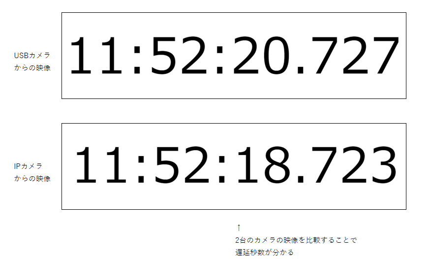

# デジタル時計

[デジタル時計を端末幅に応じて中央表示する](https://dianxnao.com/javascript%E8%AA%B2%E9%A1%8C%EF%BC%9A%E3%83%87%E3%82%B8%E3%82%BF%E3%83%AB%E6%99%82%E8%A8%88%E3%82%92%E7%AB%AF%E6%9C%AB%E5%B9%85%E3%81%AB%E5%BF%9C%E3%81%98%E3%81%A6%E4%B8%AD%E5%A4%AE%E8%A1%A8%E7%A4%BA/)
を丸パクリして、一部変更したものです

## 使い方(オンライン)

<https://yossyhal.github.io/simple-digital-clock/clock.html> を開いてください

## 使い方(オフライン)

ソースをダウンロードし、index.html をダブルクリックすると、デジタル時計ページが新しいウィンドウで開きます  
※新しいウィンドウが開かない場合は
<https://developer.mozilla.org/ja/docs/Web/API/Window/open#%E3%83%9D%E3%83%83%E3%83%97%E3%82%A2%E3%83%83%E3%83%97%E3%82%92%E9%96%8B%E3%81%8F>
の手順でポップアップを有効にしてください

## 何故これを作成したか

「USBカメラ」と「IPカメラ」の映像が画面に表示されるまでの遅延秒数の差を取得しようとした際、
<https://time.is/> を開いた状態のPCのモニタをカメラで映して、差分の秒数を計算していたのですが、  
広告が表示されるのが少し鬱陶しかったり、オフライン環境で使用できない等の問題がありました。  
デジタル時計を大きく表示させるフリーソフトは沢山あるものの、時刻を全画面で表示させたり、ミリ秒まで表示させたりする機能があるものは見つからなかったので、  
[デジタル時計を端末幅に応じて中央表示する](https://dianxnao.com/javascript%E8%AA%B2%E9%A1%8C%EF%BC%9A%E3%83%87%E3%82%B8%E3%82%BF%E3%83%AB%E6%99%82%E8%A8%88%E3%82%92%E7%AB%AF%E6%9C%AB%E5%B9%85%E3%81%AB%E5%BF%9C%E3%81%98%E3%81%A6%E4%B8%AD%E5%A4%AE%E8%A1%A8%E7%A4%BA/)
に手を加えて、自分用に作成しました。  

## 変更内容

- ミリ秒の表示機能を追加(時刻をクリックすると切り替わる)
- スクロールバーを非表示化
